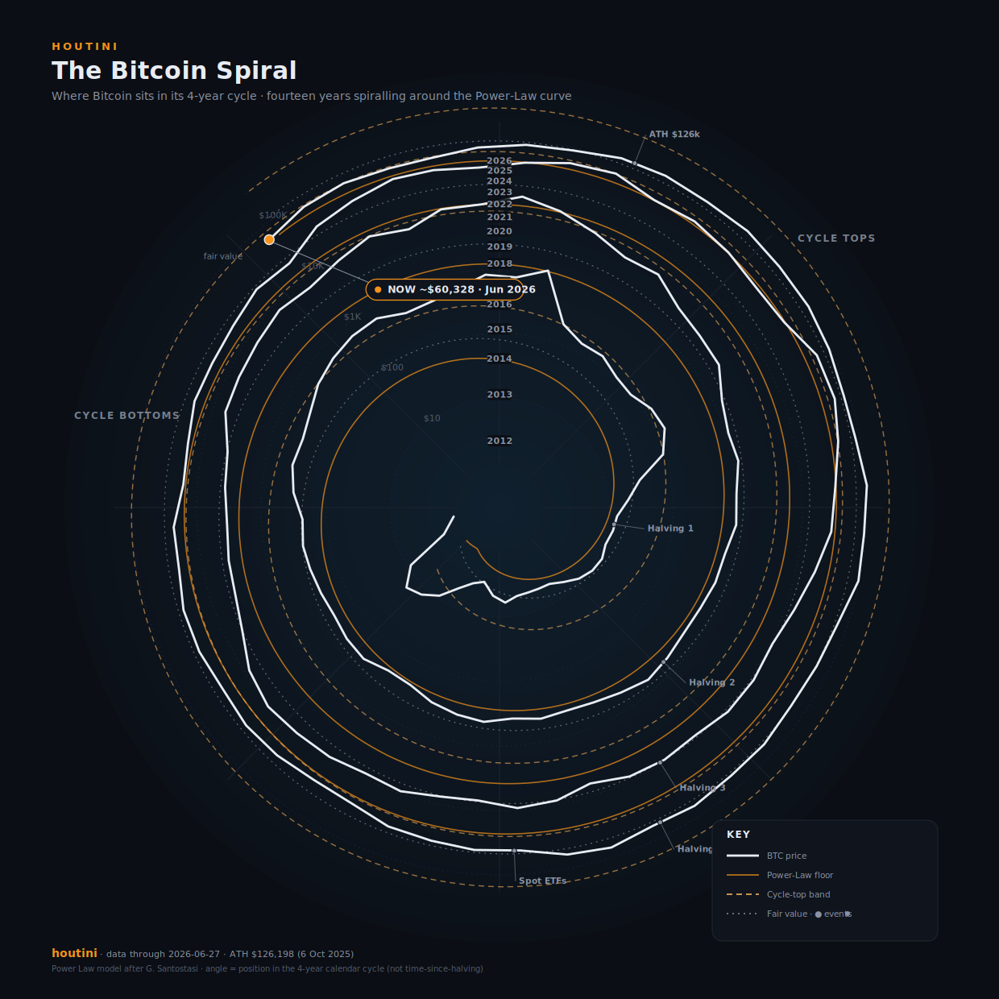

# The Bitcoin Spiral

A clean, open-source **Bitcoin monitoring dashboard** by **houtini** — Bitcoin price and the
**Power Law** on a 4-year-cycle map, plus a live panel of valuation, sentiment, flow and
network signals that synthesise into a single, plain-English verdict.

**Live:** https://richybaxter.github.io/Mandala/ · **Dashboard:** https://richybaxter.github.io/Mandala/dashboard.html

Static site, zero backend: the page is plain HTML/SVG/JS and hydrates entirely in the browser
from free public APIs. Deploys to GitHub Pages with no build step.



## The spiral — how to read it

| Element | Meaning |
|---|---|
| **Angle** | Position within the 4-year cycle (one full turn = 4 years; Jan of 2013/17/21/25 at east). |
| **Radius** | Price on a log scale — `$1` at the centre, each dashed ring a 10× level (`$10 → $100k`). |
| **Price line colour** | **Valuation**, green → red, by where price sits in the Power-Law channel (cheap → expensive). *Not* order flow. |
| **Orange spiral** | Power-Law **floor / support**. |
| **Red spiral** | Power-Law **resistance / cycle-top** band. |
| **Dashed line** | Power-Law **fair value**. |
| **Radial ticks** | Spot-ETF net flow (outward green = buying, inward red = selling). |
| **Markers** | Events diary — halvings, ETF launches, macro. |

The Power Law follows `log10(P) = a + 5.8·log10(d)`, where `d` is days since the genesis
block (2009-01-03): `a = -17.32` (floor), `a = -17.01` (fair value), `a = -16.5` (cycle-top band).
The angle encodes the **calendar** 4-year cycle, not time-since-halving.

## Live dashboard

A single static page that fetches everything client-side and renders:

- **Verdict banner** — six signals (Power-Law oscillator, price vs fair value, Mayer Multiple,
  Pi Cycle distance, Fear & Greed, 7-day taker flow) blended into one weighted call:
  **Accumulate / Lean buy / Neutral–Hold / Lean sell / Distribute**.
- **Stat tiles** — price + 24h, BTC/Gold ratio, fair value, price vs fair, PL oscillator,
  Mayer Multiple, MVRV, Fear & Greed, next difficulty adjustment, Lightning capacity, on-chain fees.
- **Charts** — price vs Power-Law channel (log), Pi Cycle Top, Mayer Multiple, Fear & Greed (60d),
  buy/sell taker-volume pressure, network hashrate (1y).
- **Flows & institutional news** — credible feeds filtered for ETF flows and *who's* buying.
- **Key-dates diary** — FOMC, CME/Deribit expiries (computed) and the halving, with countdowns.

Each panel **degrades to "n/a"** if a feed is rate-limited or CORS-blocked, so the page never breaks.

### Data sources (all free)

| Source | Used for |
|---|---|
| CoinGecko | price + 365-day history |
| Binance public (`data-api.binance.vision`) | taker-volume pressure, PAXG (BTC/Gold), Pi Cycle history |
| alternative.me | Fear & Greed index |
| mempool.space | hashrate, difficulty, Lightning, fees |
| CoinMetrics community | MVRV (best-effort) |
| rss2json | RSS → JSON bridge for the news feed |

## Embed the chart

The spiral is a single self-contained `.svg`:

```html

```

## Regenerate / update data

The spiral is generated by `generate.py` (Python standard library only):

```bash
python3 generate.py            # writes btc-mandala.svg
python3 generate.py out.svg    # custom output path
```

Editable data lives in `data/`: `btc-monthly.json` (prices), `events.csv` (diary markers),
`flows.csv` (ETF flows), `diary.json` (dashboard key dates). To refresh ETF flows from a free
feed, point `fetch_flows.py` at a CSV source:

```bash
FLOWS_URL="https://your-free-source/btc-etf-daily.csv" python3 fetch_flows.py
```

## Roadmap / TODO

- [ ] **AI market note** — scheduled GitHub Action calling **GitHub Models** (token stays in CI),
      writing a periodic `commentary.json` rendered under the verdict banner. Static-friendly;
      freshness = cron cadence.
- [ ] **Auto-refresh** — optional 60s refresh with an "updated Ns ago" timer.
- [ ] **Live ETF flows** — replace the seed `flows.csv` with a real feed (e.g. Farside).
- [ ] **Harden news** — optional CryptoPanic token to reduce reliance on the rss2json bridge.
- [x] **Share image** — Open Graph card so links unfurl with the spiral (`og.png`, generated by `design/make_og.py`).

## Accuracy notes

Spiral prices are **approximate monthly closes**. 2011–2024 is well-established history;
2025–2026 is anchored to verified points (ATH **$126,198 on 6 Oct 2025**, ~$77k in May 2026)
and the most recent months are estimates — the dashboard's *live* tiles use real-time price.
The Power-Law parameters approximate G. Santostasi's published model.

## Credit, licence & disclaimer

Dashboard and chart by **houtini**. The underlying **Power-Law model** is the work of
**G. Santostasi**, whose cyclical visualisation inspired the spiral.

**Educational only — not financial advice.** Code and output: [MIT](LICENSE).
